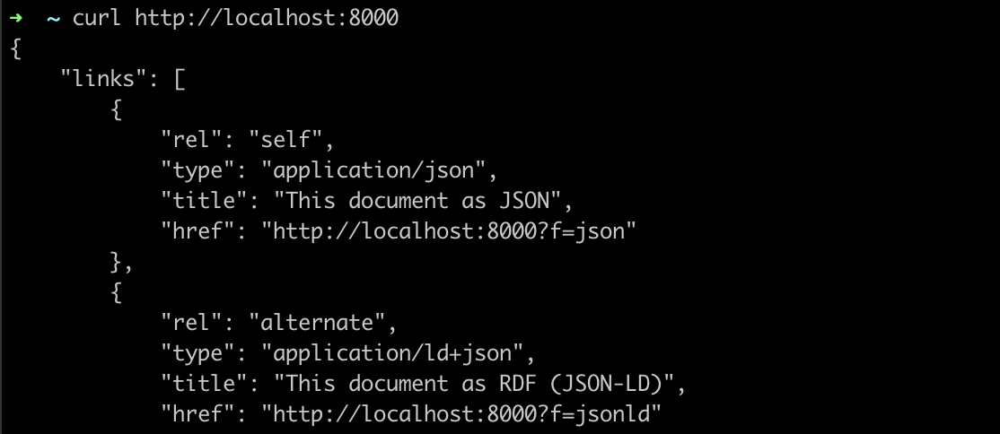
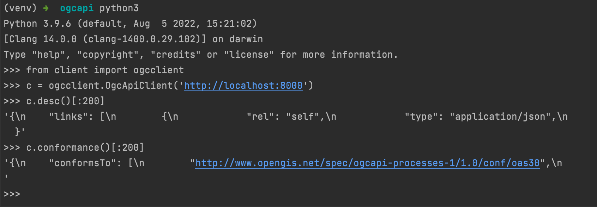
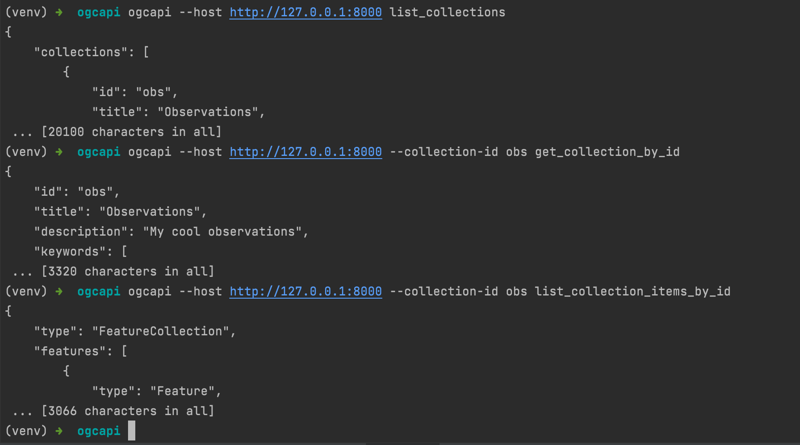

## OGC-API Python Client

Report on the implementation of a basic Python OGC API client as part of the code challenge.

### Abstract 

I browsed the relevant information of OGC API, 
and finally chose to use Python programming language and refer to
[OGC API - Common](https://ogcapi.ogc.org/common/overview.html) 
to implement several API.

This Demo project implements the following 5 API clients:

- `GET /` : Retrieves the landing page.
- `GET /conformance` : Provides a list declaring the modules that are implemented by the API.
- `GET /collections` : Retrieves all Collections that the server support.
- `GET /collections/{collectionId}` : Retrieves a Collection detail by a specific collection id.
- `GET /collections/{collectionId}/items` : Retrieves the resources provided by a particular Collection.

For this demo, 
I utilized the widely used [requests](https://requests.readthedocs.io/en/latest/) library as an HTTP client on the Python platform. 
Additionally, I used the [click](https://click.palletsprojects.com/en/8.1.x/) library to establish a command-line interactive interface 
and utilized [setuptools](https://setuptools.pypa.io/en/latest/) to bundle the source code into executable binaries.

### Installation
create a virtual python env
```shell
virtualenv venv 
source venv/bin/activate
```
install depedency packages
```shell
pip3 install -r requirements.txt
```
build ogcapi package
```shell
python3 setup.py install
```

### Usage and result

First, we need to identify the server side of the OGC API. 
In this step, we can choose some public services on the network, or just start a server on the local computer.
Here, I choose and use the open source project [pygeoapi](https://pygeoapi.io/) as the server side of the OGC API.
According to the project's [documentation](https://pygeoapi.io/documentation/), I started the OGC API service on the local port 8000.

Use the CURL command to test whether the service starts normally. 
The console prints the json data returned by the server, which means that the local service started successfully.
```shell
$ curl http://localhost:8000
```



#### use as a python module

```python
from client import ogcclient
c = ogcclient.OgcApiClient('http://localhost:8000')
c.desc()[:200]
# print GET / response
c.conformance()[:200]
# print GET /conformance response
 ```



#### use as a cli tool

```shell
$ ogcapi --host http://127.0.0.1:8000 list_collections
# retrieves all Collections.
$ ogcapi --host http://127.0.0.1:8000 --collection-id obs get_collection_by_id
# Retrieves a Collection obs detail. 
$ ogcapi --host http://127.0.0.1:8000 --collection-id obs list_collection_items_by_id
# Retrieves the resources provided by Collection obs.
```



### Reference

- [OGC API - Common](https://ogcapi.ogc.org/common/overview.html)
- [Python gitignore](https://github.com/github/gitignore/blob/main/Python.gitignore)
